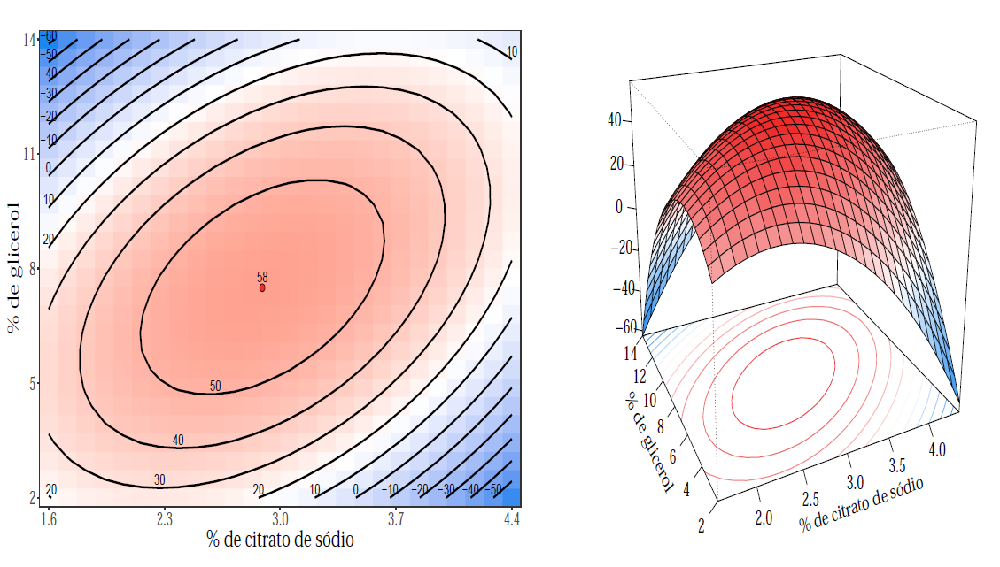

## Concepts

When a researcher has control about the experiment and her/his interest is to determine
the experimental region that optimizes the response variable, the response surface methodology
is a very suitable statistical technique for this task.

Formally introduced by George P. Box and K. B. Wilson in 1951, the response surface models
assume that the relationship between the factors $\boldsymbol{x} = (x_1, \ldots, x_p)$
(fixed) and the response variable $\boldsymbol{y}$ (random) is described by a linear model,
defined by
$$\boldsymbol{y} = f(\boldsymbol{x}) + \boldsymbol{\varepsilon}$$
where the true function $f$ is usually unknown and $\boldsymbol{\varepsilon}$ is called
random term, i.e., it represents other sources of variability that could not controlled in the
experiment.

### The functional form

In most application the true relationship between $\boldsymbol{y}$ and $\boldsymbol{x}$
is unknown. Hence, Taylor approximations on $f$ are considered.
The most simple approximation, for instance, is the first order Taylor expansion.
Due to its simplicity, it is common the first order model to have lack of fit concerns,
especially when the experimental region presents some curvature.
In such cases, approximations of higher order are required.
In general, second order models are sufficient to describe the surface.

Another relevant aspect to determine the functional form of the model is data collection,
that is, the experimental design.
The desirable properties of a design are:

- **Rotatability:**
when the same quantity of information about response surface in the same distance $d$ is
independently of direction in relation to the central point of experiment.

- **Orthogonality:** when the linear, interaction, quadratic, or higher order of the model are independent.

With the design established and the appropriate model fitted, the next step is to determine
the optimal region or walk towards and optimal region.
For this, mathematical techniques to determine and characterize the optimal region are used.

Interested readers in a more detail discussion with theoretical aspects about response
surface methodology can access this [work](https://github.com/AndrMenezes/rsm2019/raw/master/report.pdf).

## Illustrative example

Consider the experiment involving a procedure for storing bovine semen, which the main
goal is to evaluate the effectiveness of this procedure.
The experimental conditions are:

- $x_1$: percentage additions of sodium citrate,

- $x_2$: glycerol percentage, and

- $x_3$: the equilibrium time in hours before freezing with a temperature maintained at 5ºC.

The response variable, $y$, is the percentage of surviving sperm. 

For data collection, the researches adopted the $2^3$ central composite design with 
central and axial points $\alpha = 2$ without replications.

The final model chosen to describe the experiment is given by
$$\widehat{y} = 57.769 -1.312\,z_1 -2.312\,z_2 + 9.125\, z_1\, z_2 -9.048\,z^2_{1} -11.423\,z^2_{2}$$
where $z_i = \frac{x_i - m_i }{h_i}$ is the factor $i$ encoded in $-1$ and $1$, with $m_i$ denotes the 
mean between highest and lowest observed value of the factor $x_i$ and $h_i$ is half
the difference between highest and lowest observed value.

To study the experimental region we write the final model in canonical form
$$\widehat{y} = 58.06 - 5.520\,w^2_{1} - 14.948\,w^2_{2}$$
where $w_1 = -0.791(z_1 + 0.155) - 0.612(z_2 + 0.163)$ and $w_2 = - 0.612(z_1 + 0.155) + 0.791(z_2 + 0.163)$.

The two eigenvalues are negatives, then the critical point é local maximum, where 
$(z_1,z_2) = (-0.155,-0.163)$ or in the original scale of the factors
$(x_1,x_2) = (2.891,7.511)$.

A graphical representation of the estimated response surface is shown below

