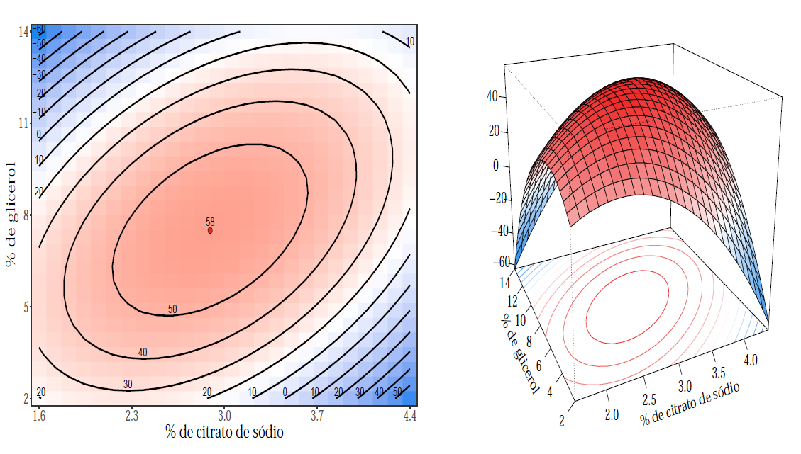

## Introdução

Quando o pesquisador possui controle sobre o experimento e seu interesse é determinar a região experimental que otimiza a
variável resposta, a metodologia de superfície de resposta é uma técnica estatística bastante apropriada.
Introduzida formalmente por Box e Wilson em 1951,
os modelos de superfície de resposta assumem que a relação entre os fatores $\mathbf{x} = (x_1, \ldots, x_p)$ (fixos) e a variável resposta $\mathbf{y}$ (aleatória) é
descrita por um modelo linear, definido por
$$\mathbf{y} = f(\mathbf{x}) + \mathbf{\varepsilon}$$
em que a verdadeira função $f$ é usualmente desconhecida e $\varepsilon$ é denominado de erro aleatório, isto é,
representa outras fontes de variabilidade que não puderam ser controladas no experimento.

Na maior parte das situações a verdadeira relação entre $\mathbf{y}$ e $\mathbf{x}$ não é conhecida.
Assim, aproximações obtidas por meio da expansão de Taylor da função $f$ são consideradas.
A aproximação mais simples, por exemplo, é o modelo de primeira ordem, o qual considera uma expansão de Taylor de
primeira ordem.
Devido sua simplicidade é comum o modelo de primeira ordem apresentar problemas de falta de ajuste,
principalmente quando a região experimental apresenta alguma curvatura.
Nestes casos, utiliza-se aproximações de ordem maiores.
Em geral, modelos de segunda ordem são suficientes para descrever a superfície.

Outro aspecto relevante para determinar a forma funcional do modelo é a coleta dos dados, ou seja, o delineamento experimental.
De forma geral, as propriedades desejáveis de um delineamento são:

  - Rotabilidade: quando a mesma quantidade de informação sobre a superfície de resposta na mesma distância $d$ independente da direção em relação ao ponto central do experimento.

  - Ortogonalidade: quando os efeitos lineares, de interação, quadráticos ou ordem superiores do modelo são independentes.

Com o delineamento estabelecido e o modelo apropriado ajustado o próximo passo é determinar a região ótima ou então
caminhar até uma região ótima. Para isso, técnicas matemáticas para determinação e caracterização da região ótima são
utilizadas.
Leitores interessados em uma discussão mais detalhada com aspectos teóricos sobre a metodologia de superfície de resposta podem acessar este [trabalho](https://github.com/AndrMenezes/rsm2019/raw/master/report.pdf).

Para ilustrar a aplicação da metodologia de resposta considere o experimento que
envolve um procedimento para armazenamento de sêmen bovino. O objetivo é compreender sua eficácia.
As condições experimentais são
adições da porcentagem de citrato de sódio ($x_1$),
porcentagem de glicerol ($x_2$) e
o tempo de equilíbrio ($x_3$) em horas antes do congelamento com temperatura mantida a 5ºC.
A variável resposta é porcentagem de espermatozoides móveis sobreviventes.

Para coleta dos dados os pesquisadores adotaram o delineamento Composto Central $2^3$ com um ponto central e ponto axial $\alpha = 2$ sem replicações.

O modelo final escolhido para descrever o experimento é dado por
$$\widehat{y} = 57.769 -1.312z_1 -2.312z_2 + 9.125 z_1 z_2 -9.048z^2_{1} -11.423z^2_{2}$$
em que $z_i = \frac{x_i - m_i }{h_i}$ é o fator $i$ codificado em -1 e 1, sendo que $ m_i $ denota a média entre o maior e menor valor observado do fator $x_i$ e $h_i$ é metade da diferença entre o maior e o menor valor observado.

Para estudar a região experimental ótima escrevemos o modelo final na forma canônica
$$\widehat{y} = 58.06 - 5.520 w^2_{1} - 14.948w^2_{2}$$
em que $w_1 = -0.791(z_1 + 0.155) - 0.612(z_2 + 0.163)$ e $w_2 = - 0.612(z_1 + 0.155) + 0.791(z_2 + 0.163)$.

Os dois autovalores são negativos, assim o ponto critico é máximo local, sendo ele $(z_1,z_2) = (-0.155,-0.163)$ ou
na escala original dos fatores $(x_1,x_2) = (2.891,7.511)$.
Uma representação gráfica da superfície de resposta estimada é ilustrada abaixo.

